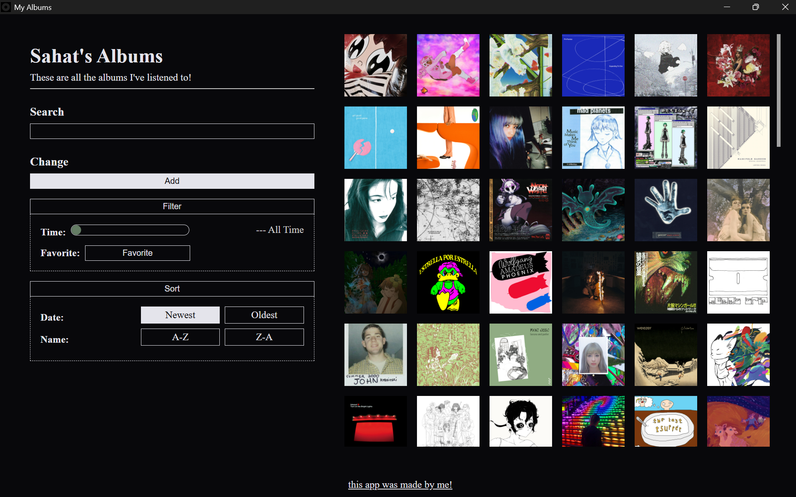

# my-albums

This is a personal app that I made to store information about the album's I've listened to. This is also what I used to get comfortable with using electron.

## Todo

- [x] Add a counter for the of albums on screen
- [x] Scroll through Albums using the arrow keys
- [x] Find artist as well as album
- [x] More Error Messages
- [ ] Code Cleanup
- [ ] Make executable available for download
- [ ] Add dropdown to search bar
- [ ] Full screen view of albums
- [ ] Nicer Animations
- [ ] Alternate View of Albums, like a list view
- [ ] Filter by description/no description